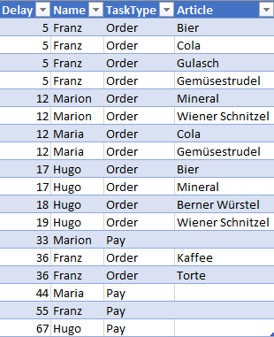
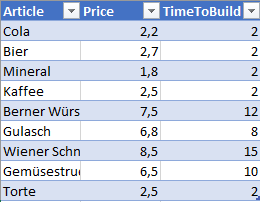
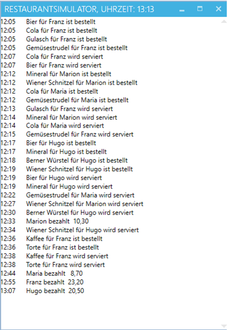

# Restaurant mit Events

## Lernziele

* .NET Collections
* Events

## Allgemein

Die schnell laufende Uhr (`FastClock`) wird auch diesmal verwendet. Zu realisieren ist die Simulation eines Restaurantbetriebs mit Gästen und einem Kellner. Damit Ihre Daten mit dem Musterausdruck übereinstimmen, initialisieren Sie die Uhrzeit am Beginn mit 12:00.

Die Aufträge der Gäste sind in der Datei `Tasks.csv` enthalten (erste Zeile enthält Überschrift). Die erste Spalte enthält die Zeit, wann der Auftrag auftritt (Verzögerung in Minuten zur aktuellen Zeit der schnell laufenden Uhr). 
Die folgenden Spalten enthalten den Namen des Gastes, die Bezeichnung des Ereignisses und optional die Artikelbezeichnung.

Der Name des Gastes ist eindeutig, d.h. alle Aufträge bis zur Bezahlung werden einem Gast zugeordnet.

Die zweite Datei (`Articles.csv`) gibt für die einzelnen Artikel an (Artikelname ist eindeutig), was sie kosten und wie lange deren Zubereitung dauert.
 

Ein Kellner steuert den ganzen Ablauf. Er nimmt die Bestellungen entgegen, verwaltet seine Aufträge, serviert die Artikel nach der Zubereitung und kassiert die Rechnungssumme bei den Gästen ab.

Der Kellner beobachtet die schnell laufende Uhr und wird seinerseits von der GUI beobachtet. Dazu bietet er ein entsprechendes Event an.

Die Anwendung ist objektorientiert aufzubauen. Das heißt, nicht die Abläufe stehen im Zentrum des Entwurfs, sondern die realen Objekte (`Waiter`, `Guest`, `Article`, `Order`). Es ist auch wieder eine Zweischichtanwendung (GUI und Logik) zu realisieren.
 
## GUI

Die Meldungen des Kellners sind in einem `TextBlock` auszugeben. 

In der Titelleiste der Anwendung läuft die Uhrzeit der schnell laufenden Uhr mit.

